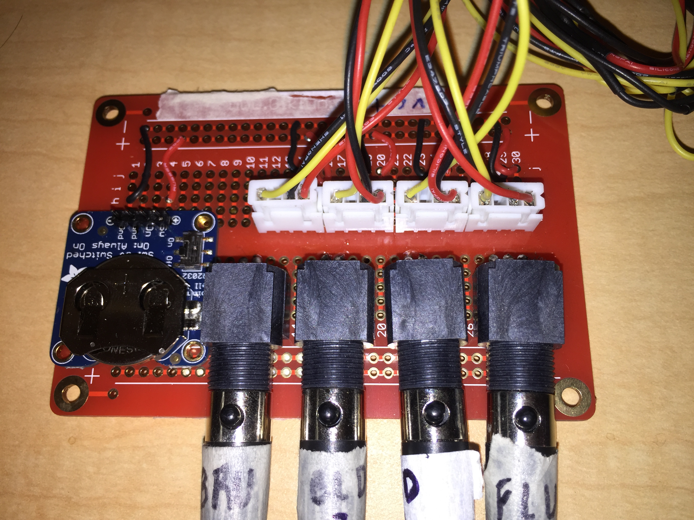
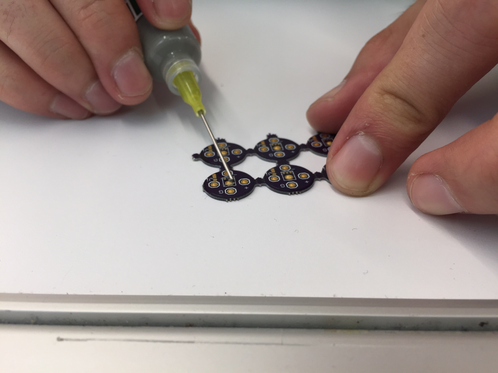

# MEMS FOA Mic

## About
This is a first order ambisonic microphone that uses MEMS {analog} capsules (ICS-40720). This repository contains instructions to make your own system as well as code to help you process your recordings, encode the data, and will in the future contain a more sophisticated version of this project which allows for USB connectivity. The repo also has 3D models which you can print.

## Why

Ambisonic hardware is extremely expensive and hard to come by. MEMS capsules are cool because they have great part-to-part consistency. Over the years their SNR and frequency response have improved drastically. With a little bit of processing before encoding we can get a decent ambisonic recording that's made from parts costing around $50. The size of these capsules also make it possible to theoretically achieve distortion free pressure gradients well above 20kHz.

## What

1. CAD models (to make enclosure)
2. Gerber files (to make PCBs)
3. Matlab functions (processing and plotting)
4. Instructions/suggestions (to build)

## Before you move forward

The most expensive thing in this build is the 4-channel interface for recording. If you don't have one or you don't intend on buying one then there is no need to read on. The one we bought is $150 new, perhaps you can find one used for slightly cheaper. Our next design will try to use USB direct to the computer so the cost should be substantially lower.

The other items on this list are not very expensive but without some items the process becomes much more difficult (we believe). The one key item is the reflow oven to mount the capsules. So far we have gotten lucky with finding a professional reflow oven but if you can't you might want to try looking on youtube for tips to surface mount parts without a reflow oven.

Besides this you should be willing to invest a little bit of money on certain items that you might not already have laying around. We have managed to get the cost down quite a bit but there is still a long way to go.

## Materials

Each item on this list has a link to suggested site for purchasing the thing.

1. [30 gauge AWG wire](https://www.amazon.com/StrivedayTM-Flexible-Silicone-electronic-electrics/dp/B01KQ2JNLI/ref=sr_1_1_sspa?keywords=30+awg&qid=1556571822&s=gateway&sr=8-1-spons&psc=1)
  * Used to connect multiple PCBs with mounted MEMS to BoB (Breakout Board) via pin housing. BoB used to supply 3V to MEMS in lieu of complicated step-down circuit relying on phantom power (48V).
  * I used individual braided wires but you can also try with multicore cables and single strand, it's all a matter of preference. The flexibility of the cables is important however.
    * Note: The insulation in the recommended product is a bit too thick for my taste but it works.
2. [Four pin housing/connectors](https://www.amazon.com/OCR-Connector-Housing-Assortment-640Pcs-Set/dp/B071JLCFT6/ref=sr_1_1_sspa?keywords=housing+connectors&qid=1556571909&s=gateway&sr=8-1-spons&psc=1)
  * Used to connect each microphone to BoB. This way only one BoB is needed for all three mics. The mics can be connected and disconnected. If the BoB breaks a new one can easily be made. Make sure the size you buy fits your PCB. We use 2.54mm ones.
3. [Right angle mini XLR connectors](https://www.mouser.com/ProductDetail/Switchcraft/TRAPC3MX?qs=sGAEpiMZZMv0W4pxf2HiV8A0R3F5127qpI46s22ojyQ%3D) {not same I used but should work}
  * Go on the BoB. Send signals to audio interface for recording.
4. [Mini XLR to XLR cables (x4)](https://www.amazon.com/dp/B07GMF5JVY/ref=sspa_dk_detail_0?psc=1&pd_rd_i=B07GMF5JVY&pd_rd_w=LiEZH&pf_rd_p=8a8f3917-7900-4ce8-ad90-adf0d53c0985&pd_rd_wg=OUh9o&pf_rd_r=WG689DARFN3HMFGHV3NJ&pd_rd_r=9c7e717b-6ac3-11e9-b12e-253105b62179) {not the same ones I used but should work}
  * To connect the BoB to the audio interface. This is the expensive bit. XLR connectors would not fit on the protoboard 😢
  * Make sure to label the heck out of everything.
  * In the image you can see the Adafruit BoB for the 3.3V coin cell battery soldered unto the protoboard. The four pin housing units are also soldered and connected to the mini XLR adaptors. In this project we used the ICS-40720 in single-ended mode so no CMR was used. This is ok since the distance is really short. The reason we did this was because we could not see signal out of the second channel, and we don't trust what we can't see. There are a couple extra cables soldered below. [This site](http://www.clarkwire.com/pinoutxlrbalanced.htm) shows the pinout for the XLR protocol. Make sure you use consistent coloring schemes.

    <p align="center">
      
    </p>


5. [3V coin cell BoB from Adafruit + headers.](https://www.adafruit.com/product/1870?gclid=CjwKCAjwwZrmBRA7EiwA4iMzBP3FB21Aru9Q0nQUxxH0qUOuSwB5bc1OHON3UCgyggRGDbX4wH-0ExoCb90QAvD_BwE)
  * Naturally you'll want some batteries as well. You can buy these anywhere, they are fairly ubiquitous. They are called CR2032's.
  * The adafruit BoB was soldered to the protoboard.
  * In the future we want to make our own custom board.
6. [A standard double-sided PCB to mount the coin cell BoB](https://www.amazon.com/Gikfun-Solder-able-Breadboard-Plated-Arduino/dp/B071R3BFNL/ref=sr_1_4?keywords=protoboard&qid=1556572543&s=gateway&sr=8-4)
  * I ended up buying a "proto-board" since I'm a newby. That way you can build your circuit on a breadboard and then just replicate it exactly as is on the PCB.
7. [A four channel audio interface](https://www.sweetwater.com/store/detail/UMC404HD--behringer-u-phoria-umc404hd-usb-audio-interface)
  * I bought a Behringer U-Phoria UMC404HD for $150. The only problem is that the knobs for the gain are analog, if you can get a cheap one with digital gain control that'd be better.
  * Make sure to never turn on phantom power, I am not sure what happens but I don't want to find out.
8. [The PCB files we are using](https://github.com/gzalles/MEMS_FOA_Mic/tree/master/pcb) + [online service to produce them](https://jlcpcb.com/) (these are very small I doubt a DIY mill can do it).
  * Download them from this repo and send them to your service of choice. There are services that do the assembly for you but those can be very expensive. Part of the fun is mounting these but if you can't I might be able to send you some. Ask me to put my product on Tindie so you can buy these. It should only be like $5...
  * We recommend [this service](https://jlcpcb.com/quote), they will send you the boards but you'll still likely want to assemble yourself.
9. [Some MEMS IC40720](https://www.digikey.com/product-detail/en/tdk-invensense/ICS-40720/1428-1120-1-ND/6148222)
  * Download the data-sheet to get the heat profile for the reflow oven.
  * Apply the paste to the PCBs and use tweezers to gently lay the capsules on, don't press down, the heat from the oven should take care of everything.
  * Again, look on youtube for alternate reflow solutions. There are a myriad of videos of inventive people surface mounting without reflow ovens.
10. [Solder paste](https://www.amazon.com/Clean-Lead-Solder-Paste-Grams/dp/B017RTTR14/ref=asc_df_B017RTTR14/?tag=hyprod-20&linkCode=df0&hvadid=312039830589&hvpos=1o1&hvnetw=g&hvrand=7899694229947333250&hvpone=&hvptwo=&hvqmt=&hvdev=c&hvdvcmdl=&hvlocint=&hvlocphy=9053667&hvtargid=pla-845853512152&psc=1&tag=&ref=&adgrpid=63202739518&hvpone=&hvptwo=&hvadid=312039830589&hvpos=1o1&hvnetw=g&hvrand=7899694229947333250&hvqmt=&hvdev=c&hvdvcmdl=&hvlocint=&hvlocphy=9053667&hvtargid=pla-845853512152)
  * Used to surface mount the capsules unto the PCBs.
  * Careful, this can be toxic. Work in a well ventilated area.
11. [A reflow oven or home solution to surface mounting](https://www.manncorp.com/reflow-ovens-bench-top-mc-301.html) {search for one at your university}
  * Note: unfortunately these are very hard to mount since the pads are not exposed during soldering. The best way to do it without a reflow oven is with an electric hot plate (as far as I know, have not tried it yet).
  * Some known solutions include: hot plates, DIY reflow ovens made from convection ovens and heat guns (that last one might be tricky for this).
12. [A soldering station + solder](https://www.amazon.com/Soldering-Electronics-Adjustable-Temperature-Desoldering/dp/B06XFT1TPJ/ref=asc_df_B06XFT1TPJ/?tag=hyprod-20&linkCode=df0&hvadid=312111858656&hvpos=1o1&hvnetw=g&hvrand=4169765281798860709&hvpone=&hvptwo=&hvqmt=&hvdev=c&hvdvcmdl=&hvlocint=&hvlocphy=9053667&hvtargid=pla-571061621463&psc=1).
  * You will use this to solder every component that needs soldering other than the MEMS capsule and the surface mounted capacitor.
  * It helps to have thin solder since the leads can get quite small and the thinner the solder the easier it will melt. Also recommend getting some "helping hands" to prop stuff up.
13. [A 3D printer](https://formlabs.com/3d-printers/form-2/) or a [3D printing service](https://www.3dhubs.com/).
  * The are a ton of services online so if you don't have access to an SLS printer don't sweat. You might need to wait a few days for them to ship you the models however.
  * The better the 3D printer the easier your life. We have tried many different printers some work better than others. Try finding a Form2 3D printer. If you can't then order online. If it's too expensive a cheaper printer will work but it will take some trial and error.
  * [Here is another one](https://www.shapeways.com/). Shapeways actually has educational discounts if you have a .edu email.
14. [A laser cutter](https://www.epiloglaser.com/) or a [laser cutting service](https://make.ponoko.com/)
  * We will use this to make foam rings that keep the PCBs in place.
  * If you need some ask me to mail you some. I will just ask for shipping.
15. [The foam for the rings](https://www.amazon.com/Bulk-Buy-Foamies-10-Pack-1199-21/dp/B00KDMQB4Y/ref=pd_bxgy_201_img_2/147-7770462-0925407?_encoding=UTF8&pd_rd_i=B00KDMQB4Y&pd_rd_r=331578be-6c41-11e9-93e4-9f5b0bbd650f&pd_rd_w=HrmuL&pd_rd_wg=hguFt&pf_rd_p=a2006322-0bc0-4db9-a08e-d168c18ce6f0&pf_rd_r=DBR6TS2W0TAWFFXTYNB8&psc=1&refRID=DBR6TS2W0TAWFFXTYNB8)
  * I bought some 2mm foam from Amazon. Beware when laser cutting. Fumes can be toxic. I am uncertain about the flammability of this material but I’ve laser cut it before successfully. [to do: laser cutter settings]
16. [Reaper](https://www.reaper.fm/)
  * Best DAW for this kind of work
17. [Free ambisonic decoder](https://facebook360.fb.com/spatial-workstation/) (binaural is best IMO)
  * You can use something else if you prefer. There are plenty of ambisonic tools out there.
  * FB Spatial Workstation comes with a Reaper template. You can either use encoded audio or use Sennheiser's A-to-B encoder.
  * I also have a repo with a naive encoder as a MATLAB GUI.
18. [0.1uF surface mounted capacitors](https://www.digikey.com/product-detail/en/kemet/C0805C104K5RACTU/399-1170-1-ND/411445) {pretty sure these are the ones}
  * I am pretty sure they are diaelectric so it does not matter which direction you mount them in.

## Instructions

1. Use paste to solder MEMS capsule and capacitor in the reflow oven. Use the spec sheet to get the right heat curve, ensuring that no components are damaged. This is by far the hardest part of the process so do it first. It takes patience and perseverance. If you get a stencil it should be easier. I will try to upload a stencil but it should not be hard to get/make one though. Use the gerber files. If you are SMDing indoors try using leadless paste, it will take longer but it will be safer. Make sure you check the heat points of both the paste and components.

<p align="center">
  
</p>
  * Some people use a toothpick for the paste application. I think it is a good suggestion.

2. Check that the capsules are working by connecting them to a an oscilloscope and voltage generator. If you don't have either of these plug them into the battery and to a soundcard. You don't want to solder cables until you have confirmed your capsules are working. It is a waste of time. I have gotten lucky finding oscilloscopes. You can buy some cheap oscilloscope kits online. Then connect ground to ground and signal to the other probe. We have consistently found a problem with the + signal in our boards so the MEMS is working in single-ended mode.

3. Solder wires to the PCBS. We recommend having a consistent color code to make things easier. Also, the sound is going to be coming in from the "sound hole" opposite the capsule, so make sure your cables are pointed away. Whatever colors you have just be consistent and keep track of what color you are using for what purpose. You might prefer to feed the cables through the enclosure first. It is up to you to decide what's easiest. Step four has more details...

  * We used this scheme:
    * Black = GRND
    * Red = V
    * White = +
    * Yellow = -


4. (You might have already done this...) After the cables have been soldered you have to feed them through the mic housing and careful fit the PCBs inside. It is important to label which capsule is going into what port. You should use tape and a sharpie for this step. The reason for this is that it will be impossible to trace the cables once inside the housing, and we will need to know which cables correspond to which capsule.


5. After that we make a cheap little BoB for the voltage supply. It is our little black box were zero magic is happening (laughs nervously). We made it so we can disconnect any capsule that might not be working and can replace it if need be. Getting the XLR pins is a bit tricky too but they have diagrams for that online (we shared a link before...). We used mini XLRs to make the whole thing a bit neater.

6. Connect wires to a breakout board and battery to the circuit.

7. Connect audio signal to mini  XLR cables.

8. Record ambisonics A-format signals.

For even more information, check out our research!

## Code

Syntax highlighting

``` js
nothin to c hear
```

## Links

https://sites.google.com/s/0Bz2vToUDaO82b2thZ1JjelFhYVU/p/0Bz2vToUDaO82UkNDbG9HZGJRdDQ/edit

http://www.creativefieldrecording.com/2017/03/01/explorers-of-ambisonics-introduction/

https://wiki.xiph.org/Ambisonics

https://cm-gitlab.stanford.edu/ambisonics/SpHEAR/

https://en.wikipedia.org/wiki/List_of_Ambisonic_software

https://github.com/greekgoddj/ambisonic-lib

## Images

<p align="center">
  
</p>
